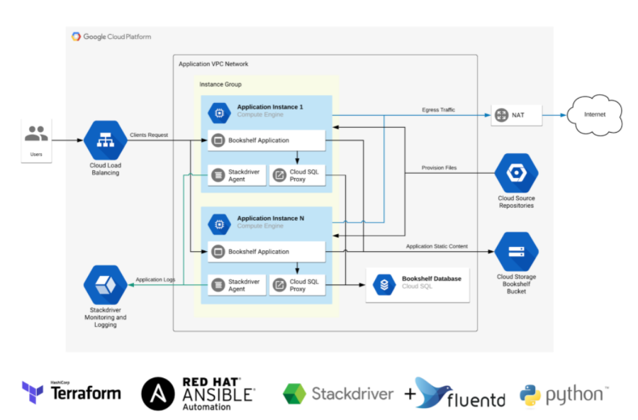

```
 Task status:         [x] - Done        [-] - In progress 
```
# 1. Terraform
### [ x ] Store infrastructure state in remote state file in a separate Cloud Storage bucket
### [ x ] Create VPC Network
### [ x ] Create Cloud NAT
### [ x ] Create SQL instance with private ip
### [ x ] Create SQL database
### [ x ] Create Cloud Storage Bucket for Application content
### [ x ] Create Service Account for Application instance
### [ x ] Create instance template (with initial startup-script)
### [ x ] Create Managed instance group
### [ x ] Create firewall rules
### [ x ] Create HTTP LB
